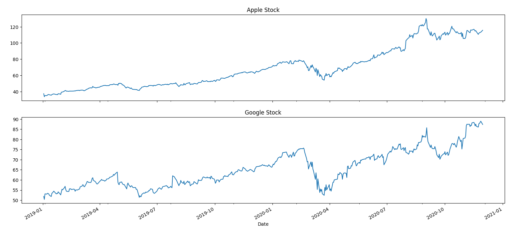
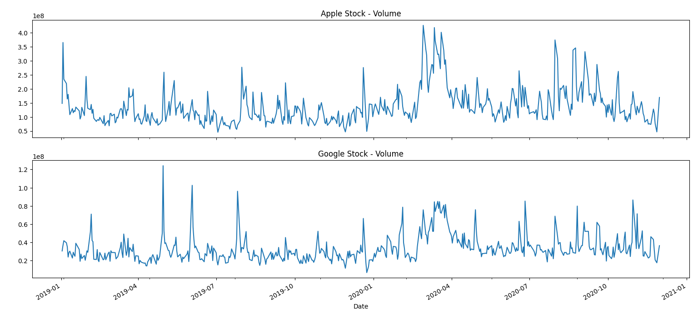
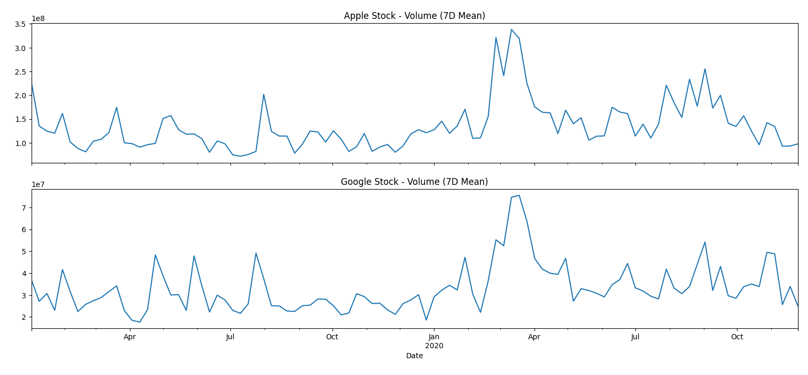
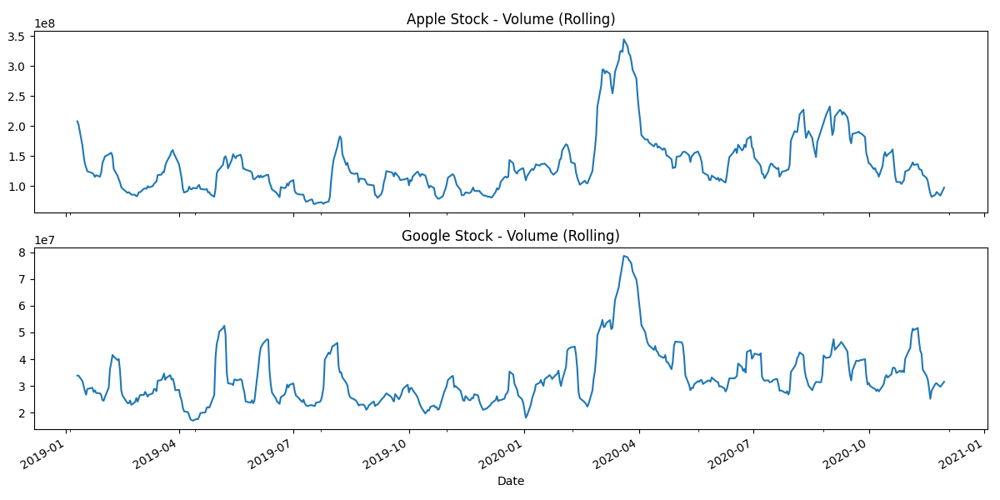

# Stock Time Series Analysis using Python: Apple vs Google (2019–2020)

[](https://www.linkedin.com/in/saniamehekshaik1004)

[](https://github.com/shaiksaniamehek1004-cell)

## Project URL

Project URL: https://github.com/shaiksaniamehek1004-cell/stock-time-series-analysis

## Project Overview

This project performs time series analysis on historical stock market data for Apple Inc. (AAPL) and Google Inc. (GOOG) using Python. Historical stock prices are collected through the Yahoo Finance API using the `yfinance` library and analyzed using Pandas time series techniques.

The project focuses on stock price trends, trading volume patterns, weekly volume resampling, and rolling average calculations to better understand market behavior.

---

## Features

* Automated stock data acquisition using Yahoo Finance
* Historical price trend analysis
* Trading volume analysis
* Weekly volume resampling
* 7-Day rolling average calculations
* Comparative analysis of Apple and Google stocks
* Time series visualization using Matplotlib

---

## Technologies Used

### Programming Language

* Python 3

### Libraries

* Pandas
* NumPy
* Matplotlib
* yfinance

---

## Project Structure

```text
stock-time-series-analysis/
│
├── analysis.py
├── README.md
├── Figure_1.png
├── Figure_2.png
├── Figure_3.png
└── Figure_4.png
```

---

## Installation

Install the required libraries:

```bash
pip install numpy pandas matplotlib yfinance
```

---

## How to Run

Navigate to the project folder:

```bash
cd stock-time-series-analysis
```

Run the script:

```bash
python analysis.py
```

---

## Analysis Performed

### 1. Closing Price Analysis

The closing prices of Apple and Google stocks are visualized to observe long-term price movements and market trends.

#### Observations

* Apple showed strong growth throughout 2019–2020.
* Both stocks experienced a decline during the COVID-19 market crash in early 2020.
* Apple recovered faster and achieved stronger growth by the end of 2020.

---

### 2. Trading Volume Analysis

Daily trading volume is analyzed to understand investor activity.

#### Observations

* Apple consistently recorded higher trading volumes than Google.
* Significant volume spikes occurred during periods of market uncertainty.
* Increased trading volume often coincided with major price movements.

---

### 3. Weekly Volume Resampling

Trading volume is resampled into 7-day intervals using Pandas resampling techniques.

#### Purpose

* Reduce daily market noise.
* Identify broader trading activity trends.
* Improve trend visibility for analysis.

---

### 4. Rolling Average Analysis

A 7-day rolling average is calculated for trading volume.

#### Benefits

* Smooths short-term fluctuations.
* Highlights underlying trends.
* Helps identify periods of unusually high investor participation.

---

## Generated Visualizations
### Figure 1 – Stock Price Comparison


  This chart shows a side-by-side view of the final daily prices (closing prices) for Apple and Google stocks throughout 2019 and 2020. It lets you easily see how both companies' stock values grew over time and how they both dropped during the market crash in early 2020 before recovering.

### Figure 2 – Daily Trading Volume



  This graph tracks the total number of shares bought and sold for both Apple and Google each day. It highlights how active investors were, showing that Apple generally had much higher daily trading activity than Google, with massive spikes during major market events. 

### Figure 3 – Weekly Average Volume (7-Day Mean)



  This visualization takes the messy daily trading data and groups it into 7-day chunks to show the average weekly activity. By smoothing out the daily spikes, it makes it much easier to see the broader, long-term trends in investor interest.

### Figure 4 – Rolling Average Volume


  
  This chart uses a moving 7-day average to smooth out sudden, short-term fluctuations in trading. It acts like a steady wave line that helps you clearly identify sustained periods where investor participation was unusually high or low.

---

## Key Findings

* Apple demonstrated stronger price appreciation during the study period.
* Both stocks experienced similar reactions to major market events.
* Trading volume increased significantly during periods of uncertainty.
* Weekly resampling and rolling averages provided a clearer view of long-term market behavior.

---

## Repository URL

Repository URL: https://github.com/shaiksaniamehek1004-cell/stock-time-series-analysis

---

## Author

Sania Mehek

---

This project demonstrates practical applications of time series analysis, stock market data visualization, resampling techniques, and rolling statistics using Python and Pandas.
